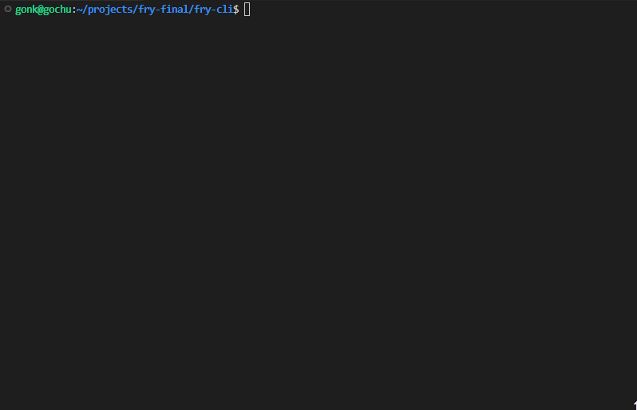

# Fry-CLI

`Fry` is a project to see how far [gpt-oss](https://huggingface.co/openai/gpt-oss-20b) can be pushed through prompt/tool definition formatting.

## Features

### Tools:
- Web browsing
- Python code execution
- File system operations
- File patching
- Shell command execution

## Example test

### Web browsing
>**Prompt:** Go through the web and extract data about recent advancements in LLM's. Then, do an analysis on the extracted data and present a report in an HTML page.



### Coding/File browsing
>**Prompt:** Go through `examples/gpt-oss` and explain how one can implement a chat interface with the model `gpt-oss?`


## Requirements

You must provide an OpenAI Chat Completions endpoint for `fry` to connect to (e.g. `http://localhost:8080/v1/chat/completions`).

## Installation

Install Fry CLI:
```bash
npm install -g @buchuleaf/frycli
```

## Getting started

Run `fry` from any directory.
```bash
fry
```

## Authentication

- Login with Google OAuth to access the dashboard and generate an API key
- Enter the API key when asked for one

## Limits

- **Free**: 200 tool requests per 5 hours
- **Premium**: 5000 tool requests per 5 hours ($10/mo)

## Example setup

1. `llama.cpp` to host the model
```bash
./llama-server.exe -hf ggml-org/gpt-oss-20b-GGUF -c 0 --n-cpu-moe 99 -ngl 99 --jinja --temp 1.0 --top-p 1.0 --top-k 0.0 --reasoning-format none -fa -b 8192 -ub 4096 --chat-template-kwargs "{\`"reasoning_effort\`": \`"high\`"}"
```
2. Run `fry` in any directory
3. Pick desired endpoint
4. Login to dashboard with Google OAuth
5. Generate and enter API key
6. Begin!

## Notes

I plan to continue developing the project. Premium is only for those who wish to support continued development.

*Support for other models in consideration...*

***Chat histories are not saved.***

## Todo

- Add MCP support
